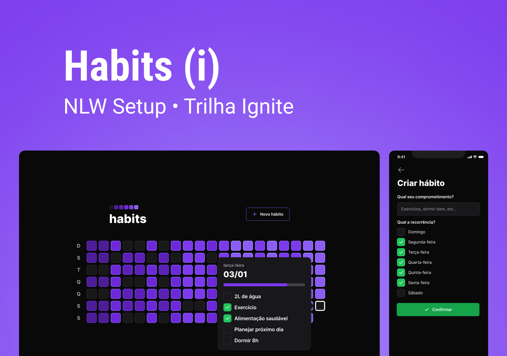

# NLW SETUP - IGNITE
> This is the first NLW of the year in the road Ignite 
&nbsp;
# Contents
- [NLW SETUP - IGNITE](#nlw-setup---ignite)
- [Contents](#contents)
- [About](#about)
    - [This is the first NLW of the year in the road Ignite](#this-is-the-first-nlw-of-the-year-in-the-road-ignite)
- [Installation](#installation)
    - [Pre-requisites](#pre-requisites)
    - [Run this project](#run-this-project)
      - [Clone this repository](#clone-this-repository)
- [Technologies](#technologies)
# About
### This is the first NLW of the year in the road Ignite

- [ x ]  Aula 01 - Iniciando o projeto de ponta a ponta
- [ x ]  Aula 02 - Avançando o back-end e Front-end 
- [ x ]  Aula 03 - Finalizando o layout web e mobile
- [ x ]  Aula 04 - Conectando a API
- [ x ]  Aula 05 - O próximo nível

&nbsp;
# Installation
### Pre-requisites

Before starting, you will need to have the following tools installed on your machine: [Git](https://git-scm.com), [Node.js](https://nodejs.org/en/), [Expo](https://docs.expo.dev/) and [Npm](https://www.npmjs.com/). It's good to have an editor to work with the code like [VSCode](https://code.visualstudio.com/).

### Run this project 
#### Clone this repository
```bash
git clone https://github.com/felipecepluki/nlw-setup-ignite.git
```
# Technologies
The following tools were used in building the project:
- [TypeScript](https://www.typescriptlang.org/)
- [Prisma](https://www.prisma.io/)
- [Fastify](https://www.fastify.io/)
- [Vite](https://vitejs.dev/)
- [React](https://pt-br.reactjs.org/)
- [Tailwind CSS](https://tailwindcss.com/)
- [SQLite](https://www.sqlite.org/index.html)